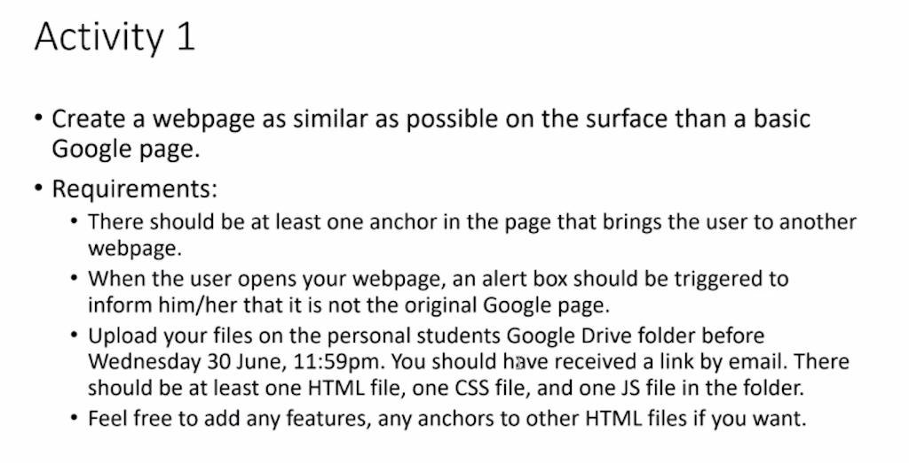

# Snippets of Classroom Exercise : Activity 2~7

## The consolidated snippets can be viewed [here](classroom-exercises-consolidated.js) 

### Activity 1
1. [Activity 1](https://scrimba.com/scrim/cB8vwytw)

### Activity 2 ~ 7
2. [Quadratic roots](https://scrimba.com/scrim/c4Qm2Vcp)

3. Activity 2: Ballistics of an angry bird

4. Tax Income Exercise

5. User Age Exercise

6. Collatz conjecture

7. Prime Number

