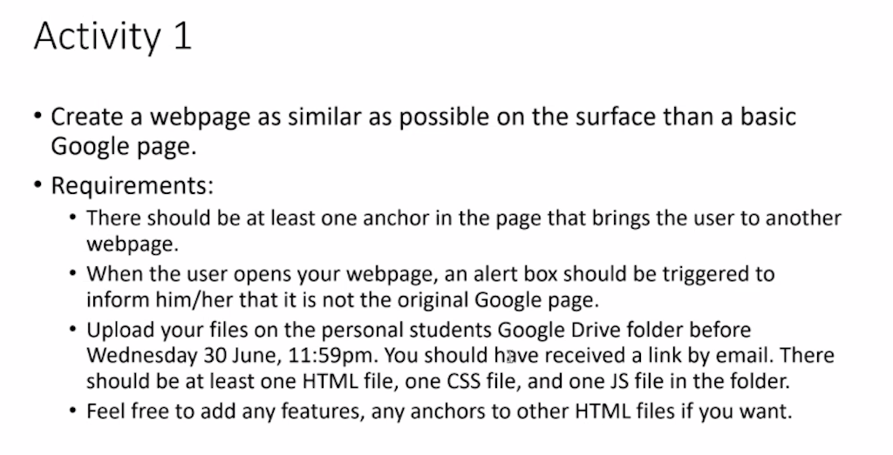
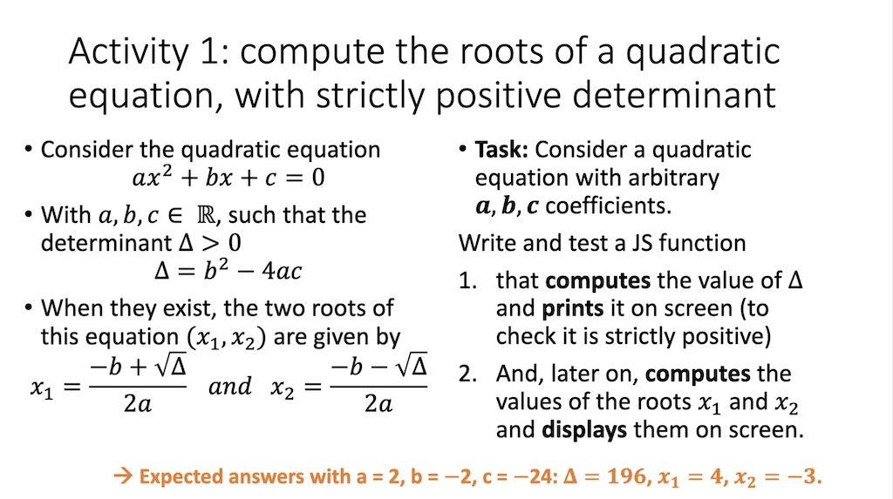
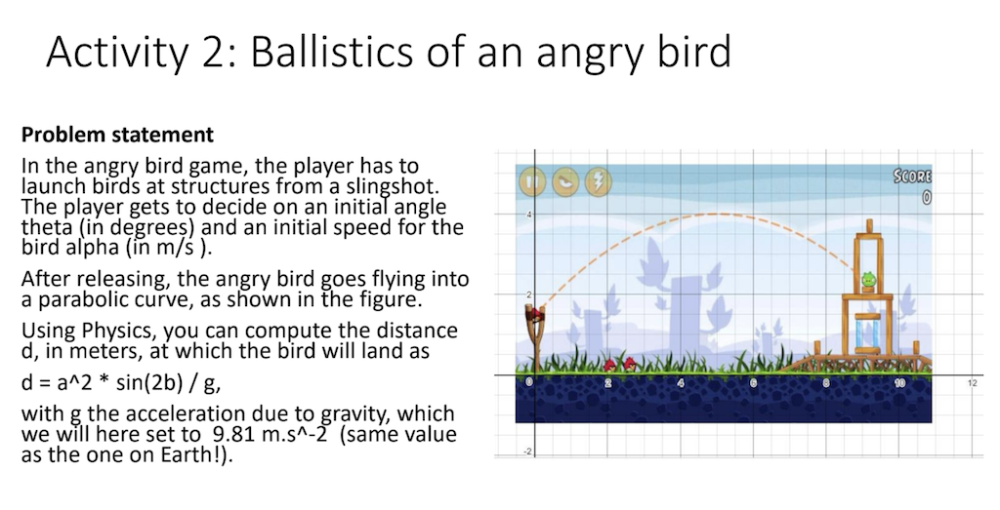
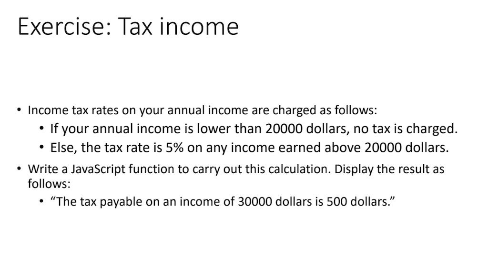
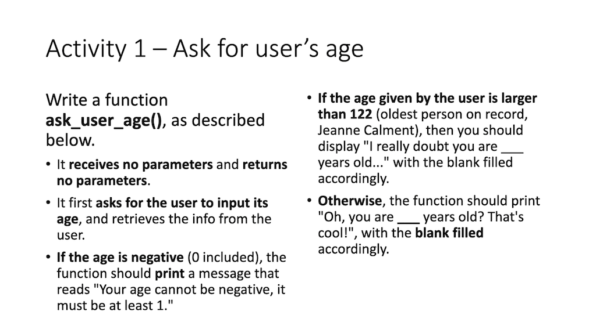
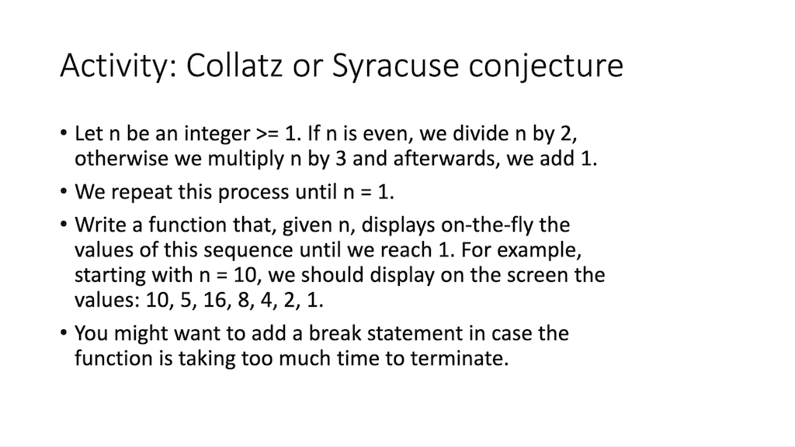
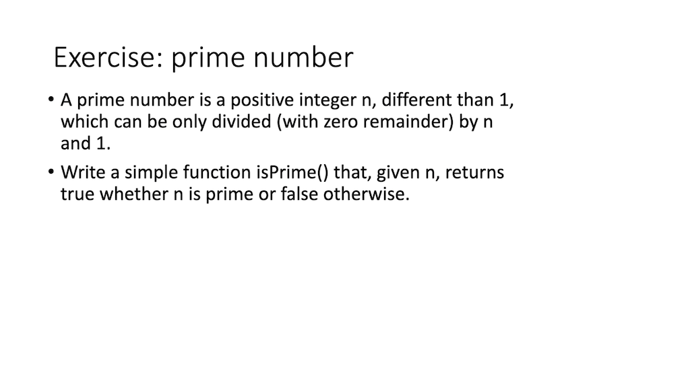

# Homework

### Activity 1
1. [Activity 1](activity1/index.html)
 > The codes are in the "activity1" folder of the github repo  
 > 

# Snippets of Classroom Exercise : Activity 2~7
## The consolidated snippets can be viewed [here](consolidated-snippets.js) 

### Activity 2 ~ 7
2. [Quadratic roots](https://scrimba.com/scrim/c4Qm2Vcp)

3. [Ballistics of an angry bird](https://scrimba.com/scrim/c4Qm2Vcp)

4. [Tax Payable](https://scrimba.com/scrim/c4Qm2Vcp)

5. [User Age Exercise](https://scrimba.com/scrim/c4Qm2Vcp)

6. [Collatz conjecture](https://scrimba.com/scrim/c4Qm2Vcp)

7. [Prime Number](https://scrimba.com/scrim/c4Qm2Vcp)

