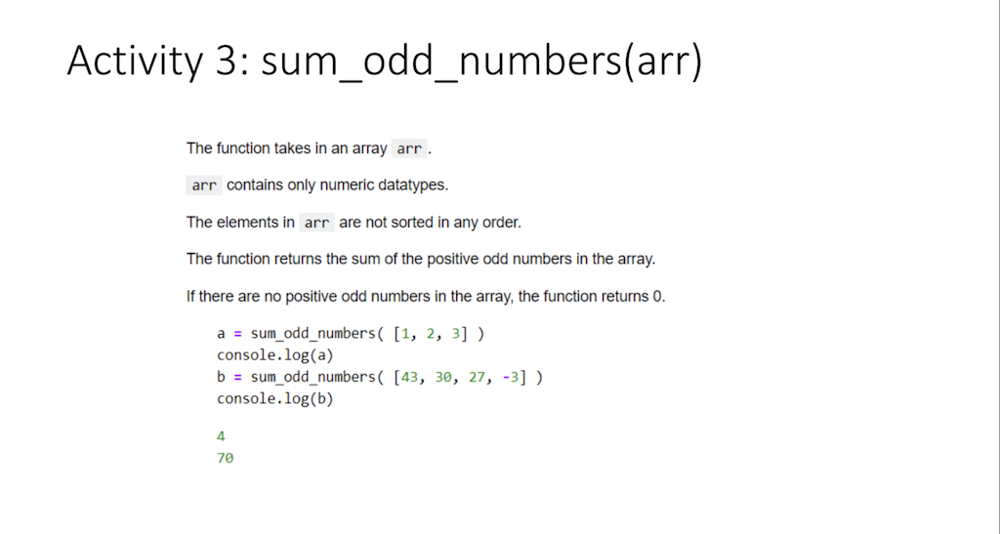

# Homework for Lessson 2021-07-13

# Snippets of Classroom Exercise : Activity 1-10
## The consolidated snippets can be viewed [here](consolidated-snippets.js) 

### Activity 1 ~ 10
1. [media(arr)](https://scrimba.com/scrim/cM3RGbsQ)

2. [middle_array(arr)](https://scrimba.com/scrim/cM3RGbsQ)

3. [sum_odd_numbers(arr)](https://scrimba.com/scrim/cM3RGbsQ)

4. [moving_average(arr)](https://scrimba.com/scrim/cM3RGbsQ)

5. [swap_elements(arr)](https://scrimba.com/scrim/cM3RGbsQ)

6. [Exam Adjustments](https://scrimba.com/scrim/cM3RGbsQ)

7. [Fibonacci Sequence](https://scrimba.com/scrim/cM3RGbsQ)

8. [McCathy 91 function](https://scrimba.com/scrim/cM3RGbsQ)

9. [Euclide Algorithm for GCD](https://scrimba.com/scrim/cM3RGbsQ)

10. [Towers of Hanoi](https://scrimba.com/scrim/cr8gnnSG)
