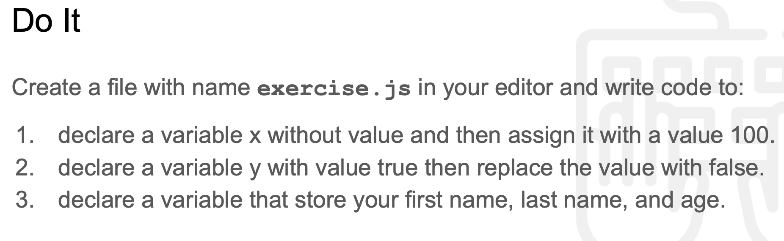
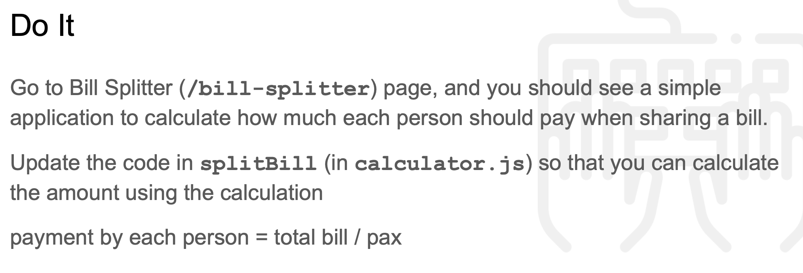
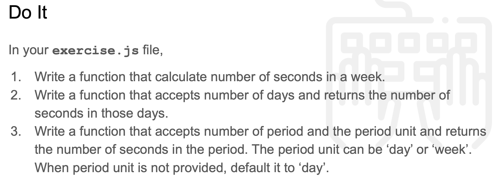
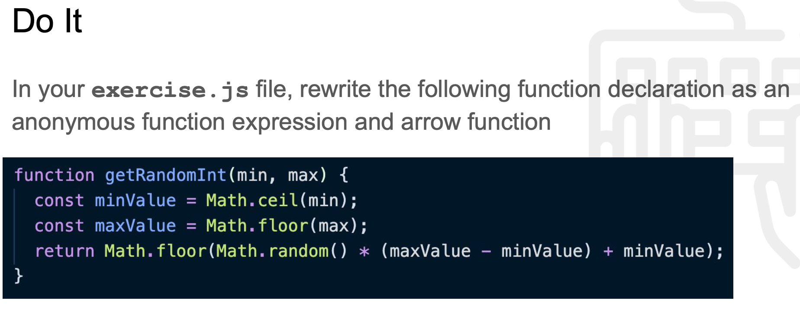
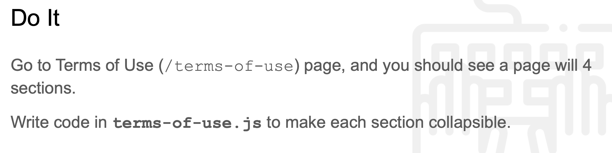
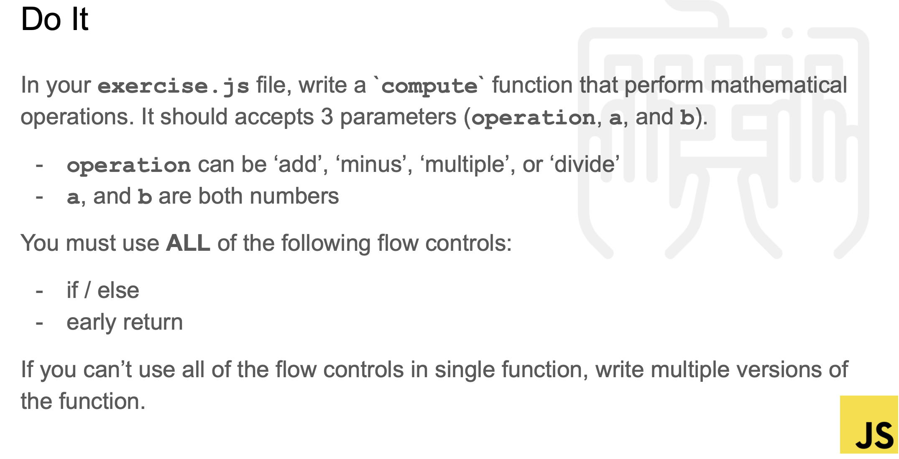
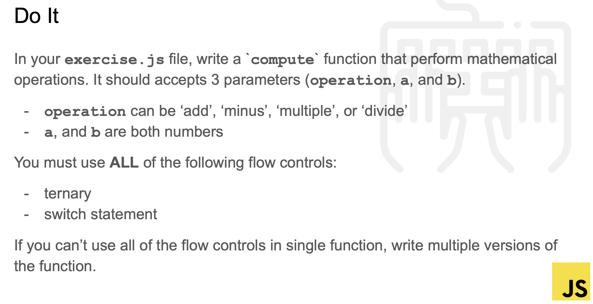
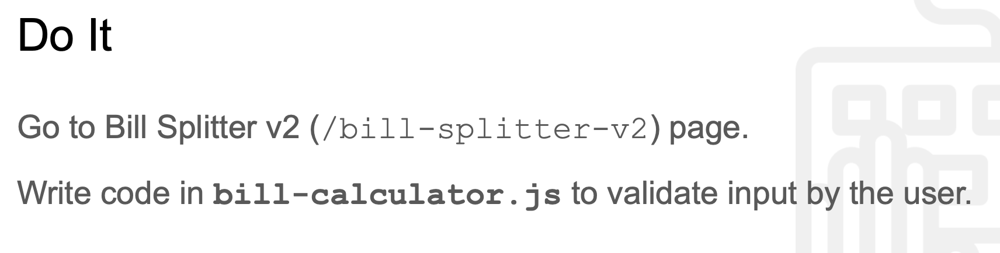
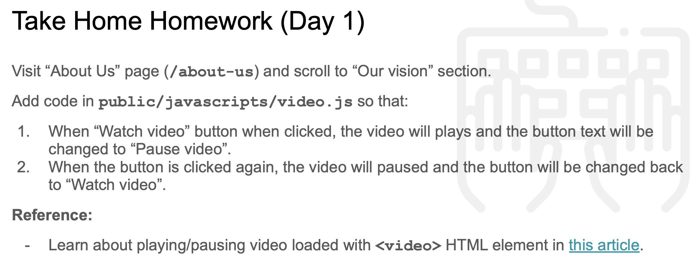

# Javascript Class Exercise on 2021-07-19


## Class Exercises
### 0. Introduction / Demo
```js
// footer.js
console.log('[DEBUG] getCurrentYear', helpers.getCurrentYear());
/* DEMO: show how to update current year */

// get the footer year element
const footerYearEl = document.querySelector("#footer-year")
// update the content of the year element to result of helpers.getCurrentYear
footerYearEl.innerHTML = `<i>hello world ${helpers.getCurrentYear()}</i>`;

console.log('[DEBUG] getCurrentDate', helpers.getCurrentDate());
/* EXERCISE: practice how to update current date */

// TODO: get the footer today element
const footerDateEl = document.querySelector("#footer-today");
// TODO: update the content of the today element to result of helpers.getCurrentDate
footerDateEl.innerHTML = helpers.getCurrentDate();
```

### 1. Exercise 1


```js
// exercise.js
let x ;
x = 100;

let y = true;
y = false;

let james = {
    "firstname": "james",
    "lastname" : "ee",
    "age": 18
}
console.log(x, y, james);
```  

### 2. Exercise 2

```js
// calculator.js
function splitBill() {
  alert('splitBill is called');

  // TODO: get bill total and number of pax
  const billTotal = Number(document.querySelector("#billTotal").value);
  const pax = Number(document.querySelector("#pax").value);

  // TODO: calculate amount for each person
  let eachPerson = billTotal / pax;
  // console.log(`[DEBUG] ${eachPerson}`);
  
  // TODO: display the result
  document.querySelector('#result').innerText = `SG$ ${eachPerson.toFixed(2)}`;

}
```

### 3. Exercise 3


```js
// exercise.js
function noSecondsinWeek (){
    return 60*60*24*7
}

console.log(`There are ${noSecondsinWeek()} seconds in a week`);

function numberOfSeconds (n){
    return 60*60*24*n
}
console.log(`There are ${numberOfSeconds(7)} seconds in a week`)

function numberOfSecondsPeriod (n, period){
    switch(period) {
        case "week":
        case "weeks":
            console.log("******** weeks ********");
            period = 7;
            break;
        case "month":
        case "months":
            console.log("******** months ********");
            period = 30;
            break;
        case "year":
        case "years":
            console.log("******** years ********");
            period = 365;
            break;
        default:
            console.log("******** days ********");
            period = 1;
    }
    return 60 * 60 * 24 * n * period;
}

const n = 2;
const period = "days"
console.log(`There are ${numberOfSecondsPeriod(n,period)} seconds in ${n} ${period}` )

```

### 4. Exercise 4


```js
// exercise.js
function getRandomInt(min,max){
    const minValue = Math.ceil(min);
    const maxValue = Math.floor(max);

    return Math.floor(Math.random() * (maxValue - minValue) + minValue);

}

getRandomInt1 = function (min,max){
    const minValue = Math.ceil(min);
    const maxValue = Math.floor(max);

    return Math.floor(Math.random() * (maxValue - minValue) + minValue);

}

getRandomInt2 = (min,max) => {
    const minValue = Math.ceil(min);
    const maxValue = Math.floor(max);

    return Math.floor(Math.random() * (maxValue - minValue) + minValue);
}
```

### 5. Exercise 5


```js
//terms-of-use.js
/* EXERCISE: make each section collapsible */

function makeSectionCollapsible(btnId, sectionId) {
  // <button id="toggle-btn-0" class="px-2" aria-controls="section-0">
  // <div id="section-0" class="py-3 text-justify">
  // TODO: get button and the section
  const btn = document.querySelector(`button[aria-controls=${sectionId}]`);
  const mySection = document.querySelector(`#${sectionId}`);
  // TODO: hide the section
  mySection.classList.add('hidden');
  // TODO: listen for click event on the button
  btn.addEventListener('click', function onButtonClick(){
    mySection.classList.toggle('hidden');
  })
}

makeSectionCollapsible('toggle-btn-0', 'section-0');
makeSectionCollapsible('toggle-btn-1', 'section-1');
makeSectionCollapsible('toggle-btn-2', 'section-2');
makeSectionCollapsible('toggle-btn-3', 'section-3');

```

### 6. Exercise 6


```js
const compute  = (ops, a, b) => {

    if (isNaN(a) || isNaN(b)) return "a or b is NaN";

    if (ops === '+' || ops === 'add' ) {
        return Number(a)+ Number(b);
    }

    if (ops === '-' || ops === 'minus' ) {
        return Number(a) - Number(b);
    }
    if (ops === '*' || ops === 'multiply' ) {
        return Number(a) * Number(b);
    }
    if (ops === '/' || ops === 'divide' ) {
        if (Number(b) === 0) {
            return "infinity";
        } else {
            return Number(a) / Number(b);
        }       
    }
}
```

### 7. Exercise 7

```js
const compute1  = (ops, a, b) => {

    if (isNaN(a) || isNaN(b)) return "a or b is NaN";

    switch(ops){
        case "+":
        case "add":
            return Number(a)+ Number(b);
            break;
        case "-":    
        case "minus":
            return Number(a) - Number(b);
            break;
        case "*":
        case "multiply":
            return Number(a) * Number(b);
            break;
        case "/":
        case "divide":
            if (Number(b) === 0) return "infinity";
            return Number(a) / Number(b);
        default:
            return null;
    }
}

const compute2  = (ops, a, b) => {
    return  (isNaN(a) || isNaN(b)) ? "a or b is NaN":
            (ops === 'add'      || ops === "+") ? Number(a)+ Number(b) :
            (ops === 'minus'    || ops === "-") ? Number(a)- Number(b) :
            (ops === 'multiply' || ops === "*") ? Number(a) * Number(b):
            (ops === 'divide'   || ops === "/") && (Number(b) !== 0) ? Number(a) / Number(b) :
            'infinity';
}

```

### 8. Exercise 8


```js
// bill-calculator.js
const errorCheck = (mystr, myvar) => {

  // console.log(`[DEBUG]  integer check : ${Number.isInteger(Number(myvar))}`);
  return  (isNaN(myvar)) ?  `[ERROR] ${mystr} input field must be a number.`:
          (!myvar) ? `[ERROR] ${mystr} input field cannot be empty.` :
          (Number(myvar) < 0) ? `[ERROR] ${mystr} input field cannot be negative.` :
          (Number(myvar) === 0 && mystr === "Pax") ? `[ERROR] ${mystr} input field cannot be zero.` :
          (!Number.isInteger(Number(myvar)) && mystr === "Pax") ? `[ERROR] ${mystr} input field must be an integer.` :
          false;
}

const displayResult = (number) => {return `SGD ${Number(number).toFixed(2)}`};

function splitBill() {

  const billTotal = document.querySelector('#billTotal').value;
  const pax = document.querySelector('#pax').value;
  const errorAlert = document.querySelector('#errorAlert');
  const errorMsg = document.querySelector('#errorMsg');
  
  let myBillErrorCheck = errorCheck('Bill total', billTotal);
  let myPaxErrorCheck = errorCheck('Pax', pax);

  //init errorMsg
  errorMsg.innerHTML = '';
  // TODO: validate bill total is provided
  // TODO: validate bill total is positive

  if (!!myBillErrorCheck) errorMsg.innerHTML += `${myBillErrorCheck}<br>`;

  // TODO: validate num of pax is provided
  // TODO: validate num of pax is positive
  if (!!myPaxErrorCheck) errorMsg.innerHTML += `${myPaxErrorCheck}<br>`;

  if (!!myBillErrorCheck || !! myPaxErrorCheck) {
    errorAlert.classList.remove('hidden');
    document.querySelector('#result').innerHTML = displayResult (0);
    return;
  } 

  // TODO: clear previous error message
  errorAlert.classList.add('hidden');

  const amountPerPax = Number(billTotal) / Number(pax);
  document.querySelector('#result').innerHTML = displayResult(amountPerPax);

}

document.querySelector('#splitBtn').addEventListener('click', splitBill);
```

### 9. Take home homework for day1

```js
// video.js
const video = document.querySelector('#vision-video');
const btn = document.querySelector('#play-video-btn');

let isPlaying = false;

btn.addEventListener('click', () => {
    // either use isPlaying variable or using video.paused property are both ok.
    if (isPlaying) {
        video.pause();
        btn.innerHTML = 'Watch video';
        isPlaying = false;
    } else {
        video.play();
        btn.innerHTML = 'Pause video';
        isPlaying = true;
    }
});
```